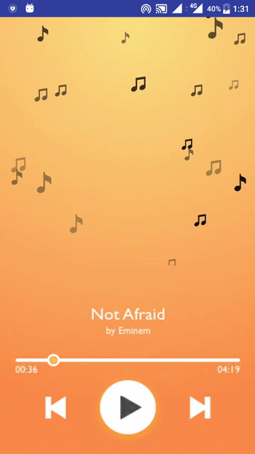

# VusikView

[](http://www.apache.org/licenses/LICENSE-2.0.html)
[](https://github.com/dynamitechetan/FogView_Library)
#### Min SDK 11
## Screnshots

                      


## How to use

If you want use this library, you can download project and import it into your workspace and add the project as a library in your android project settings.

## Using Gradle
you have to add these lines in your build.gradle file:
```xml
repositories {
        jcenter()
}

dependencies {
        compile 'dyanamitechetan.vusikview:vusikview:1.1'
}
```

## or Using Maven:
```xml
<dependency>
  <groupId>dyanamitechetan.vusikview</groupId>
  <artifactId>vusikview</artifactId>
  <version>1.0</version>
  <type>pom</type>
</dependency>
```


## BASIC USAGE
In XML
```xml
   <dyanamitechetan.vusikview.VusikView
        android:layout_width="match_parent"
        android:id="@+id/vusik"
        android:layout_height="match_parent"
        />
```
In Java    
```java
    vusikView = (VusikView) findViewById(R.id.vusik);
    vusikView.start();
```
## Using own Images 
```java
    vusikView = (VusikView) findViewById(R.id.vusik);
    int[]  myImageList = new int[]{R.drawable.note1,R.drawable.note2,R.drawable.note4};
    vusikView
            .setImages(myImageList)
            .start();
```
## Pause, Resume, Stop
```java
    vusikView.pauseNotesFall();
    vusikView.resumeNotesFall();
    vusikView.stopNotesFall;
```
The VusikView have some custom attributes, to use them , you must add this line in your xml file in the first component:
```xml
<RelativeLayout xmlns:android="http://schemas.android.com/apk/res/android"
    xmlns:app="http://schemas.android.com/apk/res-auto"
    android:layout_width="match_parent"
    android:layout_height="match_parent"
    >
</RelativeLayout>
```

## Setting a fall speed
##### Default is 0.1
```xml
    <dyanamitechetan.vusikview.VusikView
        android:layout_width="match_parent"
        android:id="@+id/vusik"
        android:layout_height="350dp"
        app:fallSpeed="0.13"
        />
```
## Setting Notes Count 
##### Default is 25
```xml
 <dyanamitechetan.vusikview.VusikView
        android:layout_width="match_parent"
        android:id="@+id/vusik"
        android:layout_height="350dp"
        app:fallCount="40"
        />
```


## License
Copyright (c) 2016 Chetan Kaushik

Licensed under the [Apache License, Version 2.0](http://www.apache.org/licenses/LICENSE-2.0.html)

* Screenshot 2 UI taken from :-  https://material.uplabs.com/posts/music-app-ui-exploration
